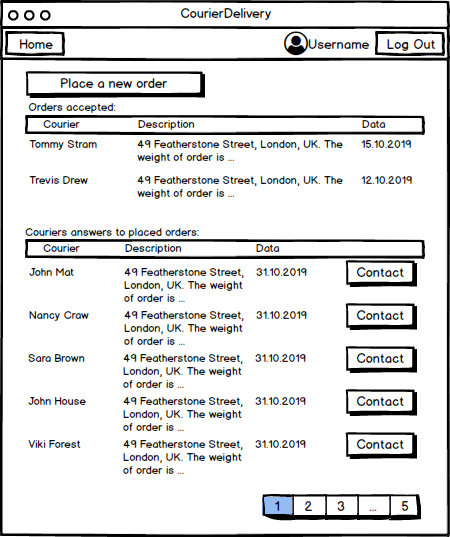
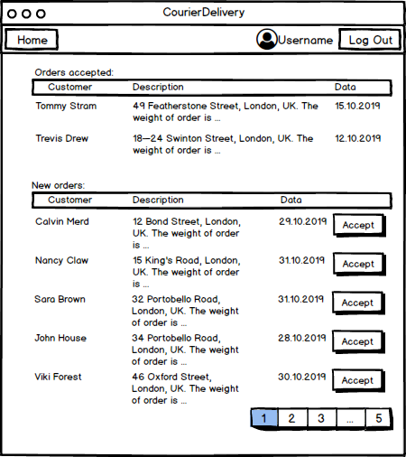
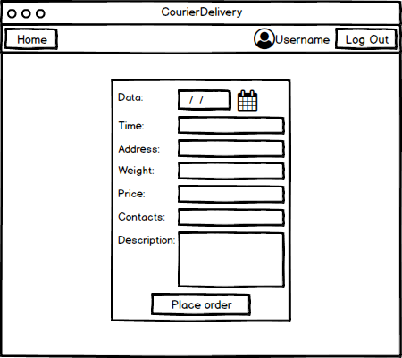
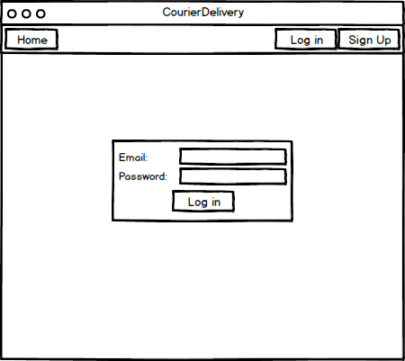
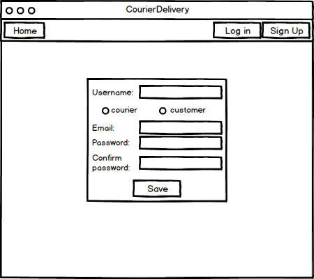

# Требования к проекту

## Содержание

1 [Введение](#intro)  
2 [Требования пользователя](#user_requirements)  
2.1 [Программные интерфесы](#program_interfaces)  
2.2 [Интерфейс пользователя](#user_interface)  
2.3 [Характеристика пользователей](#charact_users)  
2.3.1 [Аудитория приложения](#audit_app)  
3 [Системные требования](#system_requirements)  
3.1 [Функциональные требования](#functional_requirements)  
3.2 [Нефункциональные требования](#nofunctional_requirements)  
3.2.1 [Атрибуты качества](#attr_quality)  
3.2.1.1 [Требования к удобству использования](#requir_convenience_usages)  
3.2.1.2 [Требования к безопасности](#requir_security)  
3.2.2 [Ограничения](#restrictions)  
4 [Аналоги](#analogs)

## Глоссарий
* MySQL — свободная реляционная система управления базами данных.
* Пагинация — это порядковая нумерация страниц.

<a name="intro"/>

## 1 Введение
В проекте "CourierDelivery" будет реализована биржа курьеров. В данном интернет-приложении пользователь сможет сделать делать онлайн заказ на доставку, либо предложить свои возможности как курьера.

<a name="user_requirements"/>

## 2  Требования пользователя

<a name="program_interfaces"/>

### 2.1  Требования пользователя
Проект будет написан на языке Java. Для хранения данных будет использована база данных MySQL.

<a name="user_interface"/>

### 2.2 Интерфейс пользователя   
* Главная страница заказчика

* Главная страница курьера

* Страница создания заказа

* Страница аутентификации

* Страница регистрации

<a name="charact_users"/>

### 2.3 Характеристика пользователей

<a name="audit_app"/>

#### 2.3.1 Аудитория приложения
Люди, которым требуется недорогая, качественная и быстрая доставка, а также добросовестные курьеры, которые готовы предоставить свои услуги.

<a name="system_requirements"/>

## 3 Систенмые требования

<a name="functional_requirements"/>

### 3.1 Функциональные требования
Пользователю предоставлены возможности:

| Функция | Требования |
|:---|:---|
| Регистрация | Должна быть возможность зарегистрировать пользователя в систему либо в как заказчика, либо как курьера. Также при этом должен выполняться автоматический вход в систему. |
| Авторизация | Должно проверяться на наличие пользователя в системе, и происходить присваиваения ему его прав.|
| Просмотр заявок на доставку | Возможность просмотра курьером заявок, отправленных заказчиком, а так же просмотр одобренных заявок. |
| Просмотр детальной информации о заявке | Приложение должно показать всю информацию о выбранном заявке. |
| Просмотр списка курьеров по заданным параметрам | Просмотр заказчиком списка курьеров для выбора подходящего . |
| Добавление заявки на доставку | Заказчик заполняет данные и система отправляет курьеру запрос. |
| Восстановление пароля | Должна быть возможность восстановления пароля, если пользователь его забыл. |

<a name="nofunctional_requirements"/>

### 3.2 Нефункциональные требования

<a name="attr_quality"/>

#### 3.2.1 Аттрибуты качества
Достаточно важными атрибутами являются высокая производительность, удобный интерфейс, защищённость пользовательских данных. Также плюсом будет отсутствие рекламы и малое потребление ресусов.

<a name="requir_convenience_usages"/>

##### 3.2.1.1 Требования к удобству использования
* Должен быть реализован понятный и удобный пользователю интерфейс.
* Должна быть сделана пагинация для удобного просмотра прибольшом количестве заявок.

<a name="requir_security"/>

##### 3.2.1.2 Требования к безопасности
* Администратор имеет доступ к базе данных.
* Должна быть реализована функция смены пароля, если пользователь его забыл.
* При регистрации пользователю на почту должно приходить письмо

<a name="restrictions"/>

#### 3.2.2 Ограничения
* Приложение реализовано на языке Java.
* Для браузеров ограничений нет.

## 4 Аналоги
Аналогами проекта являются https://free-courier.com/ и hhttps://xytki.by/.
